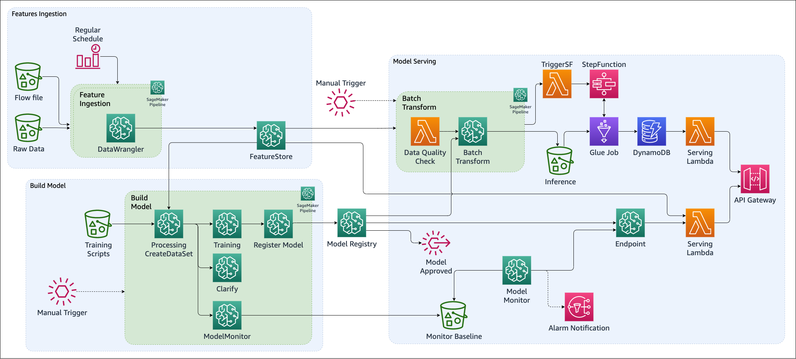

# Operationalize a Machine Learning model with Amazon SageMaker Featurestore and Amazon SageMaker DataWrangler Using CDK

- [Objective](#objective)
- [AWS Innovate - AI/ML Edition 2022](#aws-innovate---aiml-edition-2022)
- [QuickStart](#quickstart)
- [Environment](#environment)
  - [CDK](#cdk)
  - [Python](#python)
- [Deployment using AWS Cloud9](#deployment-using-aws-cloud9)
    - [Install python 3.8.*](#install-python-38)
    - [Install Poetry](#install-poetry)
    - [Update *npm* and install CDK](#update-npm-and-install-cdk)
    - [In necessary, bootstrap CDK in the account](#in-necessary-bootstrap-cdk-in-the-account)
  - [Deploy the CDK project](#deploy-the-cdk-project)
- [Solution](#solution)
- [Running Costs](#running-costs)
- [Security](#security)
- [License](#license)

## Objective
The goal of the project is to realize a demonstration of an end-to-end machine learning workflow, including the following automated pipelines:

- Feature jobs and store into Feature Store
- Train and validate models
- deploy real-time endpoint, including an API gateway and a lambda function to integrate the request payload with features from the FeatureStore
- batch inference, to periodically score a large dataset. The resulting inference are automatically uploaded to DynamoDB to be served with an API gateway

Each pipeline is deployed by CodePipeline, based on its own repository.  
The entire workflow is described by a single CFN template.  
The cloudformation template serves as the basis for a custom SageMaker Project.   


## AWS Innovate - AI/ML Edition 2022
Let us know what you thought of this lab and how we can improve the experience for you in the future by completing this poll. Participants who complete the surveys from AWS Innovate - AI/ML Edition will receive a gift code for USD25 in AWS credits (see notes 1, 2 & 3 below).  
AWS credits will be sent via email by 31 March, 2022.
 
Note: *Only registrants of AWS Innovate - AI/ML Edition who complete the surveys will receive a gift code for USD25 in AWS credits via email.*
 1. AWS Promotional Credits Terms and conditions apply: https://aws.amazon.com/awscredits/ 
2. Limited to 1 x USD25 AWS credits per participant.
3. Participants will be required to provide their business email addresses to receive the gift code for AWS credits.

for queries about the AWS Innovate - AI/ML Edition and credit codes, please contact aws-apj-marketing@amazon.com

## QuickStart
A CloudFormation template is available [here](/dist/service_catalog.template.yaml). After downloading the template on your local machine, you can deploy it following the indications in [Creating a stack on the AWS CloudFormation console](https://docs.aws.amazon.com/AWSCloudFormation/latest/UserGuide/cfn-console-create-stack.html).  
The deployment of this sample will create resources outside of AWS free tier. Please review the [Running Costs](#running-costs section of this document.


## Environment
There are two basic environments to install/configure: CDK and Python to deploy (and develop) this project:
- CDK
- Python
### CDK
The root project uses CDK to generate the CFN templates. For instructions on how to install CDK, check the relevant [documentation](https://docs.aws.amazon.com/cdk/latest/guide/getting_started.html#getting_started_install).   

### Python
The minimum python version is set to `python 3.8`,  package dependencies are managed via `pyproject.toml` file, via [`poetry`](https://python-poetry.org/).  
To install the python virtual environment, steps are

0. install poetry
1. `cd` into the folder of the project
2. `poetry install --no-dev`

To activate the venv created by poetry:

```terminal
~$ poetry shell
```

## Deployment using AWS Cloud9
To deploy the project from [AWS Cloud9](https://aws.amazon.com/cloud9/), it is necessary to install `python 3.8.x`, install `npm`, and install `cdk`. From a new environment based on AL2 (it is sufficient a `t3.small` instance)

#### Install python 3.8.*
```terminal
~$ sudo amazon-linux-extras enable python3.8
~$ sudo yum install python38 -y
```

#### Install Poetry
```terminal
~$ curl -sSL https://raw.githubusercontent.com/python-poetry/poetry/master/install-poetry.py | python -
```

#### Update *npm* and install CDK
```terminal
~$ npm install -g npm@latest cdk@latest
```

#### In necessary, bootstrap CDK in the account
```terminal
~$ export CDK_NEW_BOOTSTRAP=1
~$ cdk bootstrap
```

### Deploy the CDK project

After cloning the repository, `cd` into the repository root folder, then

1. Install and activate the poetry environment
```terminal
~$ poetry install
~$ poetry shell
```
2. Check that the project synthetize without issues
  ```terminal
  (env-name)~$ cdk synth
  ```

3. Deploy with CDK
  ```terminal
  (env-name)~$ cdk deploy
  ```

## Solution

The solution consists of an Amazon SageMaker Project that deploys three CI/CD pipelines in CodePipeline.


Each pipeline consists of

1. Source stage, a CodeCommit repository
2. Synth stage, that synthesizes a CDK project into a CloudFormation template
3. Manual approval
4. Deploy stage, that deploys the CloudFormation template

After all pipelines have completed their executions, the resulting architecture looks like the diagram below.

For a successful deployment of the entire architecture, it is necessary to upload the expected Raw data in the specified S3 location. The location, as well as other reference parameters, are stored in System Manager Parameter Store.


The SageMaker Project template also includes a Demo repository that contains two Jupyter Notebook, offering a walk-through of the demo features and an overview of the Data Scientist specific workflow.


## Running Costs

This section outlines cost considerations for running this demo. Completing the pipeline will deploy an endpoint with 1 production variants which will cost less than $4 per day. Further cost breakdowns are below.

- **CodeBuild** – Charges per minute used. First 100 minutes each month come at no charge. For information on pricing beyond the first 100 minutes, see [AWS CodeBuild Pricing](https://aws.amazon.com/codebuild/pricing/).

- **CodeCommit** – $1/month.

- **CodePipeline** – CodePipeline costs $1 per active pipeline* per month. Pipelines are free for the first 30 days after creation. More can be found at [AWS CodePipeline Pricing](https://aws.amazon.com/codepipeline/pricing/).

- **SageMaker** – Prices vary based on EC2 instance usage for the Studio Apps, Model Hosting, Model Training and Model Monitoring; each charged per hour of use. For more information, see [Amazon SageMaker Pricing](https://aws.amazon.com/sagemaker/pricing/).
  
  
  
  - The four `ml.m5.xlarge` *baseline, dataset creation* and *inference jobs* run for approx 1 minutes at \$0.23 an hour.
  - The one `ml.m5.large` instance for staging *hosting* endpoint costs \$0.144 per hour, or \$3.456 per day.
  - The two `ml.m5.4xlarge` instances for DataWrangler processing jobs run for approx 1 minutes at \$0.92 per hour.
  - The `ml.m5.xlarge` instances for *model monitor* schedule at \$0.92 an hour, and cost less than $1 per day.
  - The `ml.c5.xlarge` instance for *Clarify* runs for approx 2 minutes at \$0.235.
  - The `ml.m4.xlarge`instance for *training* runs for approx 1 minute at \$0.30 an hour.
  
  
  
- **S3** – Low cost, prices will vary depending on the size of the models/artifacts stored. The first 50 TB each month will cost only $0.023 per GB stored. For more information, see [Amazon S3 Pricing](https://aws.amazon.com/s3/pricing/).

- **Lambda** - Low cost, $0.20 per 1 million request see [AWS Lambda Pricing](https://aws.amazon.com/lambda/pricing/).

## Security

See [CONTRIBUTING](CONTRIBUTING.md#security-issue-notifications) for more information.

## License

This library is licensed under the MIT-0 License. See the [LICENSE](LICENSE) file.
