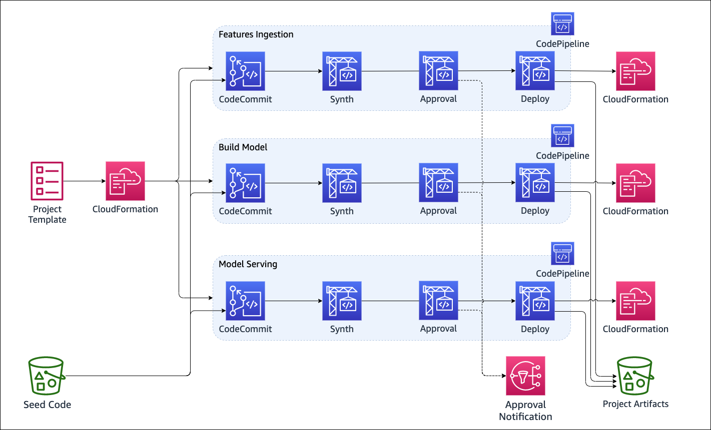

# MLOps Demo
This repository contains a [notebook](WalkThrough.ipynb) to walk you through the main features of this demo, and [another one](DataScientist.ipynb) to exemplify the cod eexpected at the end of the development of a data science project.

## Use Case
To demonstrate a typical Machine Learning flow, we will use an auto insurance domain to detect claims that are possibly fraudulent.
More precisely we address the use-case: “what is the likelihood that a given auto claim is fraudulent?,” and explore the technical solution.

### Process flow and persona

### Architecture
The SageMaker project deploys 3 CodePipieline pipelines
- Feature Ingestion
- Model Building
- Model Serving

## CI/CD

